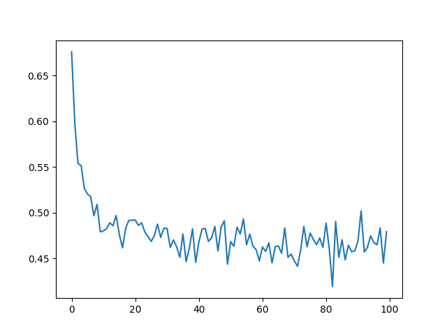
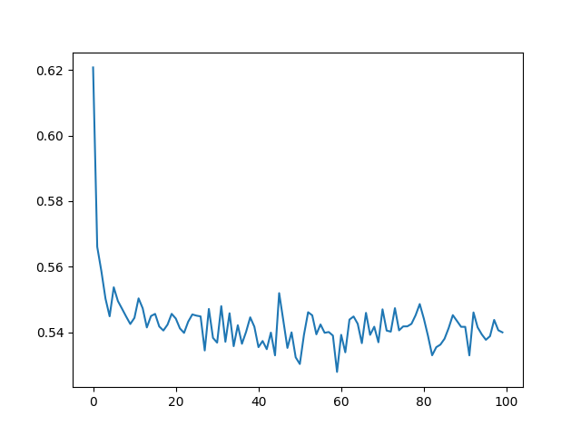
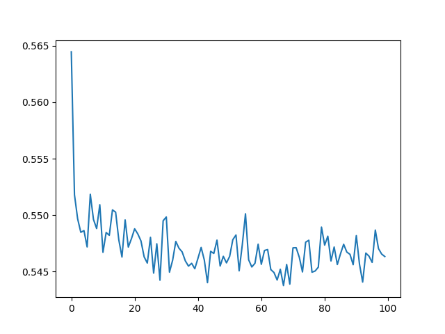
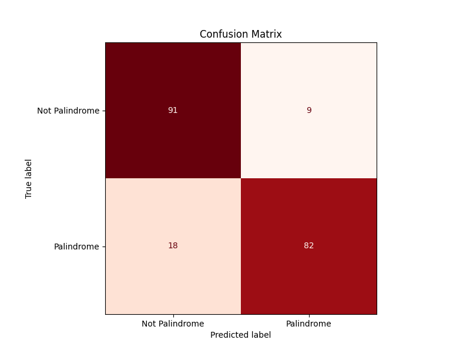
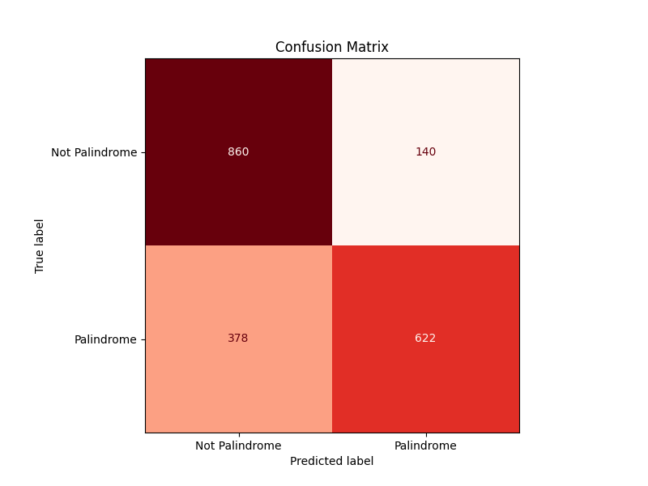
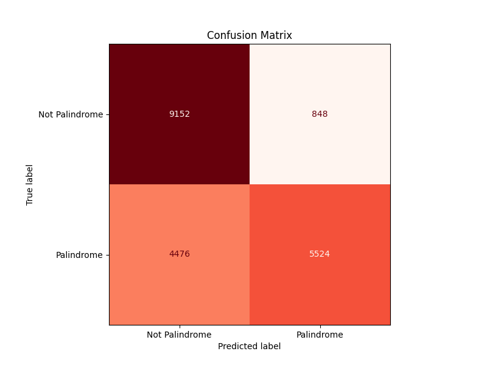

# Training log
## RNNmodel_200
### Hyperparameters
| Name    | Value   |  Name  | Value |
|--------------------|----------|-------------------|----------|
| `input_size`       | 10       | `hidden_size`     | 256      |
| `output_size`      | 2        | `learning_rate`   | 0.0005    |
| `batch_size`       | 32       | `n_iters`         | 5000    |
| `print_every`      | 500     | `plot_every`      | 50      |
### Training loss figure

## RNNmodel_2000
### Hyperparameters
| Name    | Value   |  Name  | Value |
|--------------------|----------|-------------------|----------|
| `input_size`       | 10       | `hidden_size`     | 256      |
| `output_size`      | 2        | `learning_rate`   | 0.0005    |
| `batch_size`       | 128       | `n_iters`         | 10000    |
| `print_every`      | 1000     | `plot_every`      | 100      |
### Training loss figure

## RNNmodel_20000
### Hyperparameters
| Name    | Value   |  Name  | Value |
|--------------------|----------|-------------------|----------|
| `input_size`       | 10       | `hidden_size`     | 512      |
| `output_size`      | 2        | `learning_rate`   | 0.0005    |
| `batch_size`       | 256       | `n_iters`         | 50000    |
| `print_every`      | 5000     | `plot_every`      | 500      |
### Training loss figure

# Testing results
## RNNmodel_200
The following figure shows the confusion matrix of training: 

&nbsp;&nbsp;&nbsp;&nbsp;Then, test the model with a “test.txt” concluding 100 samples, we can get the test accuracy: 60%. 
## RNNmodel_2000
The following figure shows the confusion matrix of training: 

&nbsp;&nbsp;&nbsp;&nbsp;Then, test the model with a “test.txt” concluding 100 samples, we can get the test accuracy: 73%. 
## RNNmodel_20000
The following figure shows the confusion matrix of training: 

&nbsp;&nbsp;&nbsp;&nbsp;Then, test the model with a “test.txt” concluding 100 samples, we can get the test accuracy: 70%. 
# Instructions to test on “test.txt”
(Note: The folder only contains those codes used to train and test the model without evaualting the model. )
- There are three models in the folder - "rnnmodel_200", "rnnmodel_2000", "rnnmodel_20000", which are trained with 200, 2000 and 20000 training examples respectively. 
- To test them on "test.txt", please move your "test.txt" to this folder, and then modify the 71st line of "test.py" with different models. Besides, for the model "rnnmodel_20000", you should modify 'hidden_size' to '512' in 24th line. 
- Run "python test.py" in the command line and you'll get the test accuracy of your model. 